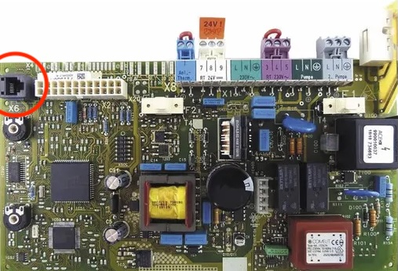
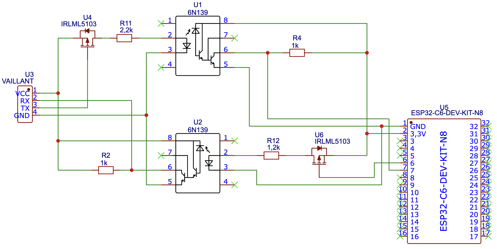

# esphome-vaillant-x6  

ESPHome component for Vaillant heating boilers with the X6 interface.  


## Overview  

This ESPHome component allows you to read various operational parameters from Vaillant heating boilers equipped with the **X6 interface**. The component communicates with the boiler via UART and can be integrated into Home Assistant.  


## Features  

Continuously reads the sensor values from the boiler and sends them to Home Assistant.
Supported sensors can be found further below. Custom sensors can be added via the yaml configuration.


## Installation  

Add the `vaillant_x6` and a `uart` component to your ESPHome configuration.

```yaml
esphome:
  name: vaillant_x6
  platform: ESP32
  board: esp32dev

external_components:
  - source: github://ulich/esphome-vaillant-x6
    components: [ vaillant_x6 ]

uart:
  id: my_uart
  tx_pin: GPIO06
  rx_pin: GPIO07
  baud_rate: 9600

vaillant_x6:
  uart_id: my_uart


  # built-in sensors:
  # Remove any sensors you do not need

  flow_temperature_sensor:
    id: vaillant_x6_flow_temperature
    name: Vorlauftemperatur
    icon: mdi:thermometer            # the default
    poll_interval: 10                # 10s, the default
    accuracy_decimals: 0             # the default
    unit_of_measurement: °C          # the default

  flow_target_temperature_sensor:
    id: vaillant_x6_flow_target_temperature
    name: Vorlauftemperatur Soll
    icon: mdi:thermometer-alert      # the default
    poll_interval: 60                # 60s, the default
    accuracy_decimals: 0             # the default
    unit_of_measurement: °C          # the default

  room_thermostat_flow_target_temperature_sensor:
    id: vaillant_x6_room_thermostat_flow_target_temperature
    name: Raumthermostat Vorlauftemperatur Soll
    icon: mdi:thermometer-alert      # the default
    poll_interval: 60                # 60s, the default
    accuracy_decimals: 0             # the default
    unit_of_measurement: °C          # the default

  return_flow_temperature_sensor:
    id: vaillant_x6_return_flow_temperature
    name: Rücklauftemperatur
    icon: mdi:thermometer            # the default
    poll_interval: 10                # 10s, the default
    accuracy_decimals: 0             # the default
    unit_of_measurement: °C          # the default

  outside_temperature_sensor:
    id: vaillant_x6_outside_temperature
    name: Außentemperatur
    icon: mdi:home-thermometer       # the default
    poll_interval: 60                # 60s, the default
    accuracy_decimals: 0             # the default
    unit_of_measurement: °C          # the default

  tank_temperature_sensor:
    id: vaillant_x6_tank_temperature
    name: X6 Speichertemperatur
    icon: mdi:thermometer-water      # the default
    poll_interval: 30                # 30s, the default
    accuracy_decimals: 0             # the default
    unit_of_measurement: °C          # the default

  tank_target_temperature_sensor:
    id: vaillant_x6_tank_target_temperature
    name: X6 Speichertemperatur Soll
    icon: mdi:thermometer-alert      # the default
    poll_interval: 60                # 60s, the default
    accuracy_decimals: 0             # the default
    unit_of_measurement: °C          # the default

  hot_water_temperature_sensor:
    id: vaillant_x6_hot_water_temperature
    name: Brauchwassertemperatur
    icon: mdi:thermometer-water      # the default
    poll_interval: 30                # 30s, the default
    accuracy_decimals: 0             # the default
    unit_of_measurement: °C          # the default

  hot_water_target_temperature_sensor:
    id: vaillant_x6_hot_water_target_temperature
    name: Brauchwassertemperatur Soll
    icon: mdi:thermometer-alert      # the default
    poll_interval: 60                # 60s, the default
    accuracy_decimals: 0             # the default
    unit_of_measurement: °C          # the default
    
  circulating_pump_sensor:
    id: vaillant_x6_circulating_pump
    name: Zirkulationspumpe
    icon: mdi:pump                   # the default
    poll_interval: 10                # 10s, the default

  burner_sensor:
    id: vaillant_x6_burner
    name: Brenner
    icon: mdi:fire                   # the default
    poll_interval: 10                # 10s, the default

  gas_valve_sensor:
    id: vaillant_x6_gas_valve
    name: Gasventil
    icon: mdi:valve                  # the default
    poll_interval: 10                # 10s, the default

  winter_mode_sensor:
    id: vaillant_x6_winter_mode
    name: Winter Modus
    icon: mdi:sun-snowflake-variant  # the default
    poll_interval: 60                # 60s, the default


  # Add custom sensors that are not yet built-in (I'm happy to add them, just create an issue or PR).
  # Check https://old.ethersex.de/index.php/Vaillant_X6_Schnittstelle for possible commands

  binary_sensors:
    - id: vaillant_x6_pump_target_status
      name: Pump Target Status
      icon: mdi:pump-off
      response_type: Status01        # Response 0x01 is ON
      command_byte: 0xa1
      response_length: 1
      poll_interval: 10              # 10s, the default is 60s

    - id: vaillant_x6_igniter
      name: Zünder
      icon: mdi:lightning-bolt
      response_type: Status0f        # Response 0x0f is ON
      command_byte: 0x49
      response_length: 1
      poll_interval: 10              # 10s, the default is 60s

  sensors:
    - id: vaillant_x6_solar_collector_temperature_no
      name: Solarkollektor Temperatur Nein!
      icon: mdi:sun-thermometer
      unit_of_measurement: °C
      accuracy_decimals: 1                # the default is 0
      device_class: temperature
      response_type: AnalogueValue2Bytes  # Currently, this is the only allowed value. Can also be used with more than 2 response bytes, only the first 2 response bytes will be interpreted
      command_byte: 0xb7
      response_length: 3
      poll_interval: 60                   # 60s, the default
```

You can also choose other GPIO pins for TX and RX on the ESP.


## Vaillant X6 Interface  

The **X6 interface** is a service port found on some older Vaillant boilers (for example on Vaillant ecoTEC classic VC 196/2 - C). It provides a simple 5V-UART communication interface for retrieving operational data.

<p align="center">
  
</p>


### Connection  

To safely connect an ESP device to the boiler's X6 interface, a **galvanic isolation** is recommended to avoid electrical damage to both the ESP but more importantly to the circuit board of the boiler. This can be achieved using optocouplers. Also note, that the ESP uses 3,3V and the X6 interface operates on 5V. **Connecting the ESP directly to the X6 interface will damage your ESP immediately!**

<p align="center">
  
</p>

Simple optocouplers like the 6N139 invert the signal, therefore an inverter is necessary. In this schematic this is achieved with an IRLML5103 PNP Mosfet.

### X6 Port

```
+------------+
--- 24V      |
--- GND      +--+
--- TX          |
--- RX          |
--- 5V       +--+
---          |
+------------+
```
(When looking at the X6 port of the Vaillant circuit board from above.)


## Acknowledgments

Many insights for this project were taken from https://old.ethersex.de/index.php/Vaillant_X6_Schnittstelle. Without this valuable information, this project would not have been possible. A big thank you to the contributors of that documentation! 🙌 A copy of the website can be found [here](./doc/Vaillant%20X6%20Schnittstelle%20–%20Ethersex_Wiki.pdf).
